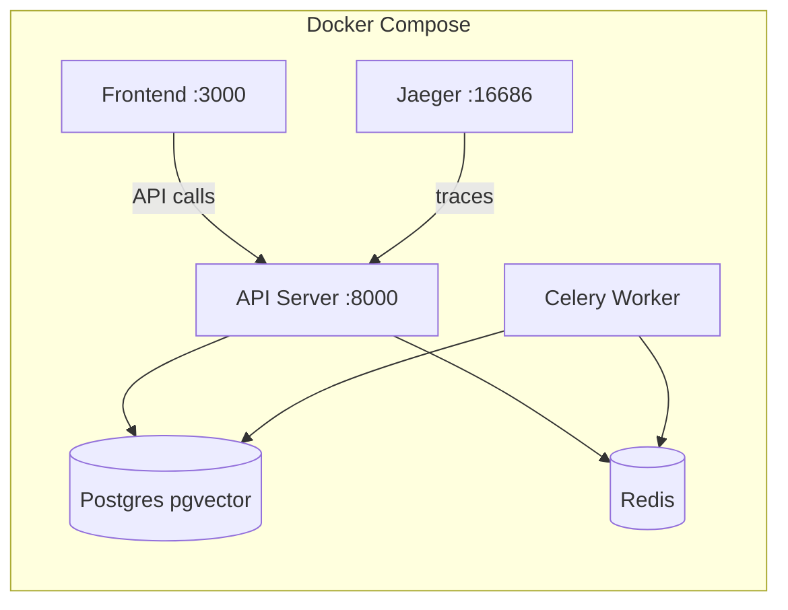

# AgentWatch System Architecture

This guide describes the internals of AgentWatch — the Reliability, Safety, and Observability layer for AI agents.

---

## Core Component Diagram

```mermaid
graph TD
    A[Host Agent Framework] -->|watch()| B(Universal watch API)
    B -->|adapter wraps methods| C[Framework Adapter]
    
    subgraph Instrumentation
        C -->|pre-execution check| G[Safety Engine]
        C -->|publishes event| D[Event Bus]
    end

    subgraph Core Engines
        D -->|consume| E[Trace Collector]
        D -->|consume| F[Reasoning Auditor]
        D -->|consume| H[Cost Tracker]
        D -->|consume| I[Alerting Engine]
        D -->|consume| J[WebSocket Forwarder]
    end

    subgraph Analysis & Storage
        E --> K[(PostgreSQL + Redis)]
        F --> L[Confidence Scorer / Hallucination Classifier]
        H --> M[Budget Governance]
        G --> N[Risk Scorer / Sandbox / Blast Radius]
    end

    subgraph API Layer
        K --> O[FastAPI /api/v1/*]
        O --> P[Dashboard UI]
        O --> Q[CLI]
    end

    subgraph Export
        K --> R[OpenTelemetry Exporter]
        K --> S[Compliance Reporter]
    end
```

---

## 1. Instrumentation Layer

### 1.1 `watch()` API

File: `agentwatch/core/watcher.py`

The single entry point that attaches monitoring to any supported AI agent framework. It accepts:

- A framework object (LangChain chain, CrewAI crew, etc.)
- A list of objects
- Optional metadata and configuration

Auto-detects the framework via `detect_framework()` and selects the correct adapter.

### 1.2 Framework Adapters

Each adapter translates framework-specific method calls into the universal `AgentEvent` schema.

| Adapter | File | Frameworks |
|---|---|---|
| GenericAdapter | `core/watcher.py` | Base class for custom adapters |
| LangChain | `adapters/langchain.py` | LangChain chains, agents |
| LangGraph | `adapters/langgraph.py` | LangGraph graphs |
| CrewAI | `adapters/crewai.py` | CrewAI crews |
| AutoGPT | `adapters/autogpt.py` | AutoGPT agents |
| AutoGen | `adapters/autogen.py` | AutoGen agents |
| OpenAI Agents | `adapters/openai_agents.py` | OpenAI Agents SDK |
| Claude Code | `adapters/claude_code.py` | Claude Code CLI |
| Smolagents | `adapters/smolagents.py` | HuggingFace smolagents |

**Lifecycle within an adapter:**

1. **Intercept** — Wrap the framework's execution method (e.g., `invoke()`, `run()`, `kickoff()`)
2. **Pre-check** — Optionally call `SafetyEngine.check_event()` to evaluate risk
3. **Normalize** — Build an `AgentEvent` with tool name, arguments, agent ID, etc.
4. **Publish** — Push the event to the `EventBus` via `publish()` or `publish_sync()`
5. **Return** — Let the original method proceed; capture result for optional post-event

### 1.3 Event Schema (`AgentEvent`)

File: `agentwatch/core/schema.py`

All events are instances of `AgentEvent` (Pydantic model, ~446 lines). Key fields:

| Field | Type | Purpose |
|---|---|---|
| `session_id` | `str` | Groups events into a trace |
| `agent_id` | `str` | Originating agent |
| `event_type` | `EventType` | TOOL_CALL, LLM_CALL, AGENT_START, AGENT_MESSAGE, TASK_DELEGATE, etc. |
| `tool_call` | `ToolCallData \| None` | Tool name, arguments, raw command |
| `tool_result` | `ToolResultData \| None` | Output, error, duration |
| `safety` | `SafetyCheckData \| None` | Pre-execution safety verdict |
| `token_usage` | `TokenUsage \| None` | Token counts and cost |
| `status` | `ExecutionStatus` | SUCCESS / FAILURE / BLOCKED |
| `is_blocked` | `bool` | Whether the Safety Engine blocked it |
| `metadata` | `dict` | Extensible key-value store |

---

## 2. Event Bus

File: `agentwatch/core/event_bus.py`

The central nervous system of AgentWatch. It is a **thread-safe publisher-subscriber** engine (~382 lines) with:

- **Sync and async dispatch** — Methods can publish synchronously (for pre-execution hooks) or asynchronously (for fire-and-forget telemetry)
- **Event filtering** — `EventFilter` allows handlers to subscribe to specific event types, agent IDs, or risk levels
- **Handler registration** — `subscribe()` / `unsubscribe()` with thread-safe locking
- **Singleton access** — `get_event_bus()` returns the global bus instance

### Publish Flow

```
Adapter → EventBus.publish(event) 
              ↓
         [ThreadPool or async gather]
              ↓
         Handler 1 (TraceCollector) → persist event
         Handler 2 (ReasoningAuditor) → score event
         Handler 3 (CostTracker) → accumulate token usage
         Handler 4 (AlertingEngine) → evaluate alert rules
         Handler 5 (WebSocket) → broadcast to clients
```

### Thread Safety

File: `agentwatch/core/event_bus.py` (see also issue #134)

All mutable state (`_handlers`, `_subscriptions`, index structures) is guarded by `threading.Lock`. Handler iteration uses a snapshot pattern to avoid race conditions during concurrent subscribe/unsubscribe.

---

## 3. Safety Engine

File: `agentwatch/core/safety.py`

The Safety Engine enforces policies before tool execution reaches the host system.

### Components

- **SafetyPolicy** — YAML-defined rules: blocked commands, allowed paths, risk thresholds
- **RiskScorer** — Classifies commands into risk levels (LOW / MEDIUM / HIGH / CRITICAL)
- **Pattern Blocker** — Regex-based matching against destructive patterns (`rm -rf`, `DROP TABLE`, data exfiltration)
- **Blast Radius Estimator** — Evaluates the impact of a command before execution (file-level, network-level)
- **Sandbox Simulator** — Ephemeral execution environment to test command outcomes

### Execution Flow

```
Adapter → SafetyEngine.check_event(event)
              ↓
         RiskScorer.assess(event.tool_call.raw_command)
              ↓
         if risk == CRITICAL → BLOCK immediately
         if risk == HIGH → check policy (block / warn / allow)
         if risk == MEDIUM → optional sandbox simulation
              ↓
         Return verdict: SAFE / BLOCKED
```

If blocked, the adapter raises `AgentWatchBlockedError`, halting execution before any damage occurs.

---

## 4. Reasoning Auditor

File: `agentwatch/reasoning/auditor.py`

Scores the quality and reliability of agent reasoning.

### Sub-modules

| Module | File | Purpose |
|---|---|---|
| HallucinationClassifier | `reasoning/hallucination.py` | Per-step novelty detection — flags identifiers used in tool calls that were never seen in prior outputs |
| ConfidenceScorer | `scoring/confidence.py` | 7-dimension heuristic score (tool_loop, repeated_failures, hallucinated_success, goal_alignment, etc.) |
| TrustScore | `reasoning/trust_score.py` | Aggregate 0-100 score from confidence + hallucination + drift + safety + blocks |
| DualEvaluator | `reasoning/dual_eval.py` | Step-level + session-level goal evaluation |
| CalibrationTracker | `reasoning/calibration.py` | FP/FN tracking, one-click recalibrate |
| DriftHeatmap | `scoring/drift.py` | Semantic drift detection across long sessions (sentence-transformers or deterministic fallback) |

### Session Scoring Flow

```
Events → ConfidenceScorer.score() → ScoringResult
                                      ↓
                              HallucinationClassifier.classify() → per-step risk
                                      ↓
                              TrustScore.aggregate() → 0-100 score
                                      ↓
                              DriftHeatmap.detect() → drift delta
```

---

## 5. Multi-Agent Orchestration

AgentWatch provides a complete multi-agent coordination layer in `agentwatch/orchestration/`.

| Module | File | Description |
|---|---|---|
| InterAgentDAG | `orchestration/dag.py` | Causal DAG tracking which agent caused which action; cycle detection |
| Failure Propagation | `orchestration/propagation.py` | BFS blast-radius analysis: what else gets impacted by a failure |
| InterAgentTrust | `orchestration/trust.py` | Per-pair trust scores based on historical interaction outcomes |
| Consensus Detector | `orchestration/consensus.py` | Semantic clustering of agent proposals, agreement ratio |
| Shapley Attribution | `orchestration/shapley.py` | Blame/credit allocation across agents using Shapley values |
| SpawningTracker | `orchestration/spawning.py` | Depth/count limits on agent creation |
| DeadlockDetector | `orchestration/deadlock.py` | Wait-for graph cycle detection |
| RaceConditionDetector | `orchestration/race_condition.py` | Overlapping resource access detection |
| ConfidenceDiscount | `orchestration/discount.py` | Confidence discount propagation across DAG edges (MAG-010) |
| CrewContext | `orchestration/crew_context.py` | Shared DAG + EventBus for crew-of-agents sessions |

### Data Flow in Orchestration

```
Agent A produces output
    ↓
InterAgentDAG records node + edge
    ↓
InterAgentTrust updates trust score
    ↓
ConfidenceDiscountPropagator computes downstream discount
    ↓
Shapley attribution assigns blame/credit
    ↓
Consensus detection evaluates agreement
```

---

## 6. Rollback Engine

File: `agentwatch/rollback/engine.py`

Provides transactional checkpoint/rollback for agent sessions.

### Checkpoint Types

| Type | Storage | Use Case |
|---|---|---|
| FILESYSTEM | Compressed tar archive | Restore files modified by agent tools |
| GIT | Git branch at current HEAD | Restore entire repository state |
| MEMORY | In-memory dict snapshot | Restore agent state variables |
| COMPOSITE | Git + filesystem | Full state rollback |

### Rollback Lifecycle

```
Create Checkpoint
    ├── FILESYSTEM: tar source directory → .agentwatch/checkpoints/snapshots/{id}/
    ├── GIT: create branch agentwatch/checkpoint/{id}
    └── MEMORY: snapshot agent state dict

Trigger Rollback
    ├── Check checkpoint exists
    ├── Git: hard reset to commit
    ├── Filesystem: extract tar to working directory
    │   └── Per-member extraction with cleanup on partial failure
    └── Return RollbackResult with status, warnings, partial_restoration flag
```

---

## 7. Cost Tracking

File: `agentwatch/cost/tracker.py`

### Budget Governance

- Tracks input/output tokens per session and per tenant
- Enforces monthly/daily spend limits
- Auto-downgrades models for simple tasks
- Handles model failover when quotas exceed

### Cost Flow

```
Event → CostTracker.accumulate(event.token_usage)
           ↓
       BudgetGovernance.check(tenant_id)
           ↓
       if over limit → WARN or BLOCK depending on policy
           ↓
       UsageRecord updated (per-tenant, per-month)
```

---

## 8. Telemetry Pipeline

### Ingestion (Cloud Mode)

File: `agentwatch/telemetry/ingestion.py`

```
Event → TenantIngestionPipeline.ingest(tenant_id, event)
           ↓
       Tenant validation (active? within quota?)
           ↓
       Rate limiter check (token bucket per tenant)
           ↓
       Data residency routing (CMP-007)
           ↓
       Batch accumulation (flush every 100 events or 5 seconds)
           ↓
       Handler dispatch → persistence, OTel export, alerts
```

### OpenTelemetry Export

File: `agentwatch/telemetry/otel.py`

Completed traces are exported as OpenTelemetry spans:

```
TraceCollector → TelemetryProvider.export_reasoning_trace()
                    ↓
                OTLP exporter → configured OTel collector
```

### Data Residency

File: `agentwatch/governance/residency.py`

Events can be routed to region-specific storage endpoints based on tenant configuration:

```
TenantConfig.residency_policy_name = "eu_only"
    ↓
ResidencyRouter.route("eu_only", current_user_region=...)
    ↓
Decision: eu-west-1
    ↓
Event metadata tagged with residency_region
    ↓
Regional handler picks region-specific storage endpoint
```

---

## 9. API Server

File: `agentwatch/api/server.py` (~1582 lines)

FastAPI application exposing the REST API and WebSocket endpoint.

### Architecture

```
Client → Rate Limiter → Auth Middleware → Route Handler → Service Layer → Database
                    ↓
               Prometheus Metrics
```

### Route Groups

| Prefix | Purpose | File (service) |
|---|---|---|
| `/api/v1/sessions` | Session CRUD, trace, replay | `server.py` → `TracingCollector`, `ReplayEngine` |
| `/api/v1/events` | Event ingestion | `server.py` → `TenantIngestionPipeline` |
| `/api/v1/safety` | Policy management, blocked events | `server.py` → `SafetyEngine` |
| `/api/v1/dashboard` | Aggregate stats | `server.py` → `TraceCollector` |
| `/api/v1/governance` | Compliance, EU AI Act reports | `server.py` → `ComplianceReporter` |
| `/api/v1/tenants` | Tenant management (cloud mode) | `server.py` → `TenantStore` |
| `/api/v1/entitlement` | Usage metering | `server.py` → `EntitlementUsageTracker` |
| `/api/v1/demo` | Demo data seeding | `server.py` → in-memory seed |
| `/api/v1/ingestion` | Pipeline metrics | `server.py` → `TenantIngestionPipeline` |
| `/ws/events` | Real-time event stream | `server.py` → `EventBus` + WebSocket broadcast |

---

## 10. Governance & Compliance

| Module | File | Regulation |
|---|---|---|
| GDPR Engine | `governance/gdpr.py` | PII detection, erasure with audit signatures |
| HIPAA Engine | `governance/hipaa.py` | PHI detection, access logging |
| EU AI Act Package | `governance/eu_ai_act.py` | Article 15 conformity assessment |
| ISO 42001 AMS | `governance/iso42001.py` | AI management system, risk/incident tracking |
| RBAC Engine | `governance/rbac.py` | Role-based access control, SAML token auth |
| Compliance Reporter | `governance/compliance_reporter.py` | Aggregate multi-framework compliance reports |
| Causal Attribution | `governance/causal.py` | Signed provenance chain for adverse outcomes |

---

## 11. Deployment Architecture



### Services

| Service | Image | Purpose |
|---|---|---|
| `postgres` | pgvector/pg16 | Primary database with vector extension |
| `redis` | redis:7 | Caching, Celery broker, rate limiting |
| `api` | Custom (FastAPI) | REST API + WebSocket server |
| `worker` | Custom (Celery) | Background task processing |
| `frontend` | Custom (Next.js) | Dashboard UI |

### Profiles

- `workers` — Launches additional Celery worker replicas
- `tracing` — Launches Jaeger all-in-one for distributed tracing

---

## 12. Data Flow Summary

```
1. Instrumentation
   Framework → watch() → Adapter wraps method calls

2. Pre-execution
   Adapter → SafetyEngine.check_event() → risk assessment

3. Publishing
   Adapter → AgentEvent → EventBus.publish()

4. Consumption (async, parallel)
   EventBus → TraceCollector (persist)
   EventBus → ReasoningAuditor (score)
   EventBus → CostTracker (accumulate)
   EventBus → AlertingEngine (evaluate rules)
   EventBus → WebSocket (broadcast to clients)

5. Storage
   TraceCollector → PostgreSQL (events, sessions)
   TraceCollector → Redis (active sessions)

6. Retrieval
   FastAPI endpoints → Database → JSON responses
   WebSocket → EventBus subscription → live push

7. Export
   Completed traces → OTel exporter → external collector
   Compliance data → ComplianceReporter → PDF/CSV reports
```
