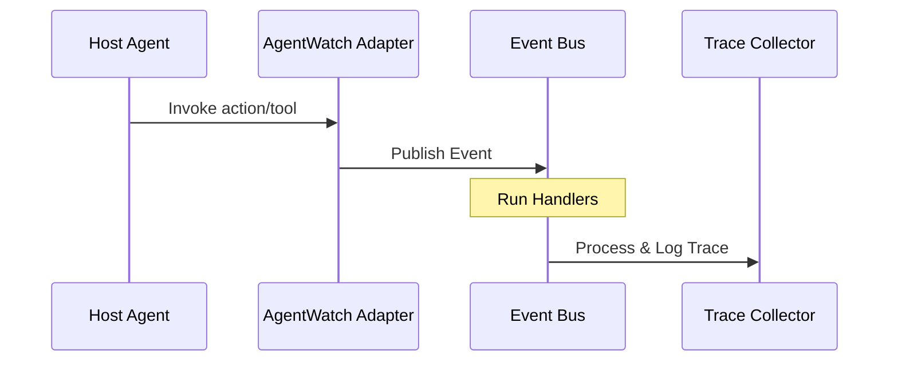

# Detailed Architecture Internals (ELUSoC_2026)

## Event Bus Internals
The event bus is a lightweight, asynchronous message distributor. It leverages a reader-writer lock mechanism (`asyncio.Lock` and `threading.Lock`) to safeguard state registration.

## Database Schema and Persistence
Sessions are serialized as `AgentSession` models and saved within SQLite or PostgreSQL. Replay logs are cached inside Redis.
